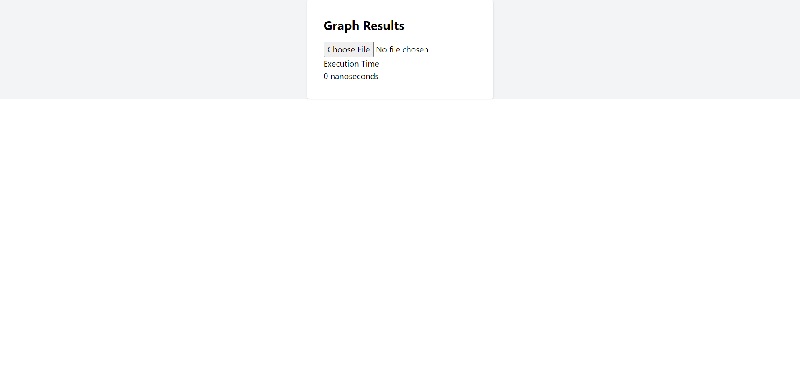
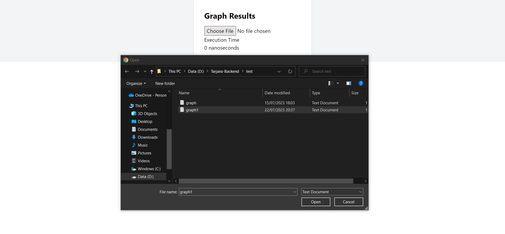
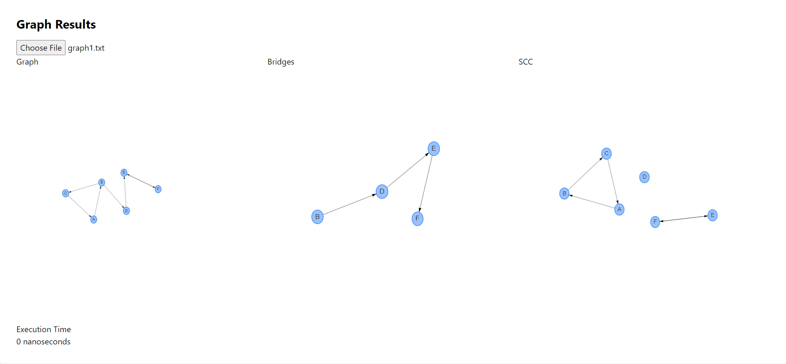

# Tarjan's Algorithm🎲
>Tugas Seleksi IRK
## Table of Contents
* [Contributors](#contributors)
* [General Information](#general-information)
* [Local Setup](#local-setup)
* [File Input Structure](#file-input-structure)
* [Frameworks and Libraries](#frameworks-and-libraries)
* [References](#references)
## Contributors
| NIM | Nama |
| :---: | :---: |
| 13521021 | Bernardus Willson  |
## General Information 
Tarjan's Algorithm is an algorithm used in graph theory to find Strongly Connected Components (SCCs) in a graph, which are groups of nodes that are directly or indirectly connected. The complexity of the Tarjan's algorithm is O(V + E), where V is the number of vertices (nodes) in the graph, and E is the number of edges.

In Tarjan's algorithm, there are several modifications that can be made to extend its functionality. One important modification is to detect "Strong bridges" or "Critical edges" in the graph. Strong bridges are edges that, when removed from the graph, will separate it into two or more strongly connected components. In the implementation of Tarjan's algorithm, when performing Depth-First Search (DFS) on the graph, when finding an edge (u, v), in addition to checking if v has been visited or not, we also check if u is the "root" of the currently processed strongly connected component. If yes, then the edge (u, v) is a Strong bridge.

The types of edges that exist in a graph are as follows:

1. Back edge: This is an edge that connects a node to an ancestor in its own DFS recursion path. Back edges occur when, during DFS, we encounter a node that has been visited but has not yet exited its subtree.

2. Cross edge: A cross edge is an edge that connects two nodes that have no ancestor-to-descendant relationship. Cross edges occur when, during DFS, we encounter a node that has been visited and has finished exploring all its subtree branches, then we backtrack to explore other nodes.

## Local Setup
<br>
1. Clone FE and BE repo using the command below: 

```
https://github.com/bernarduswillson/Tarjans-Frontend
```
```
https://github.com/bernarduswillson/Tarjans-Backend
```
<br>
2. Install dependencies :

```
yarn
```
<br>
3. Run localhost server :
<br>
for FE:

```
yarn dev
```
for BE:

```
./run.bat
```



<br>
4. Within the Website, upload the test case file, you can choose the provided test case in the test directory



<br>
5. Result will be shown in the website



## File Input Structure
For a simple visualization, you can input directed graph in the following format: (A B means there is an edge from A to B)
```
A B
B C
C A
B D
D E
E F
F E
```
## Frameworks and Libraries
* [Next.js](https://nextjs.org/)
* [React.js](https://reactjs.org/)
* [Golang](https://golang.org/)

## References
* [Tarjan's Algorithm](https://www.geeksforgeeks.org/tarjan-algorithm-find-strongly-connected-components/)
* [Tarjan's Strongly Connected Component (SCC) Algorithm (UPDATED) | Graph Theory](https://youtu.be/wUgWX0nc4NY)